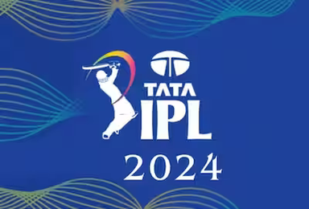
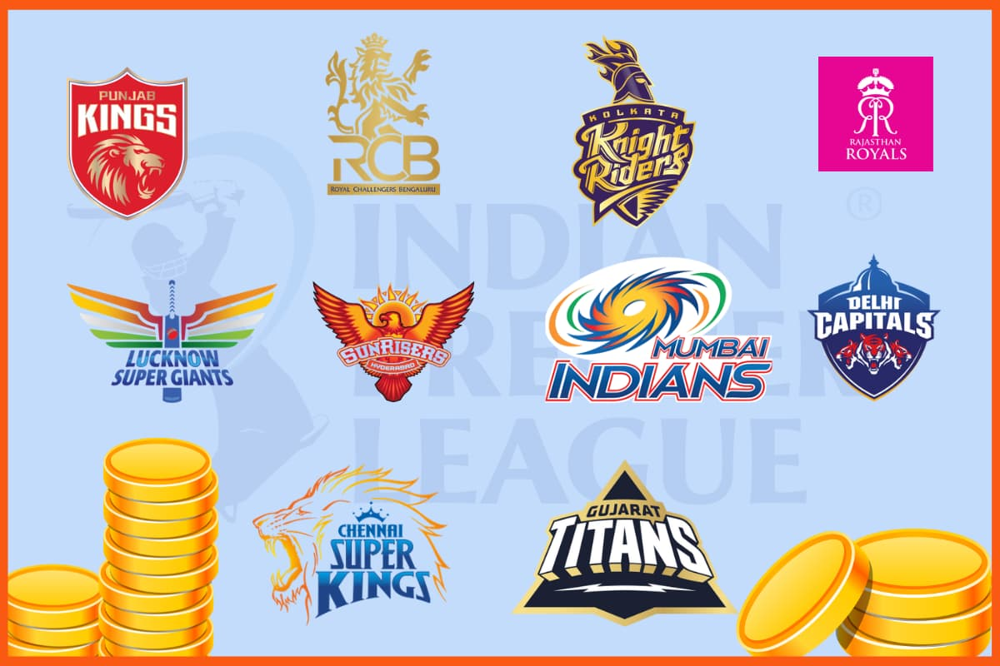

# IPL 2024 Data Analysis Project

## Overview
This project analyzes the IPL 2024 season, providing insights into team and player performances, match outcomes, and other key statistics. The dataset used is `IPL2024_match.csv`, cleaned and processed for meaningful exploration.

## Objective
The primary goal of this analysis is to:
- Understand team performances, including batting and home-away records.
- Identify patterns in winning strategies, such as batting first versus second.
- Highlight standout players and key contributors.
- Visualize data for actionable insights.

## Tools and Libraries
- **Python** for data processing and analysis.
- **Pandas** for data manipulation.
- **Matplotlib** and **Seaborn** for visualizations.
- **NumPy** for numerical operations.

## Insights and Analysis

### 1. Teams and Their Colors

Each IPL team is assigned a distinct color for visualization purposes:
- Colors: KKR: Purple,RR: Pink,SRH: Orange,CSK: Yellow,RCB: Red,KXIP: Maroon,DC: Light Blue,GT: Silver,LSG: Lavender,MI: Blue.

### 2. Team Performances
- **Winning Percentages**:
  - Calculated based on batting strategies (first or second).
- **Most Successful Teams**:
  - Comparison of overall wins and consistency.

### 3. Player Achievements
- Players with the most "Man of the Match" (MOM) awards were identified.
  - This highlights individual brilliance across matches.

### 4. Home vs. Away Performance
- **Home Wins**:
  - How each team performs in home conditions.
- **Away Wins**:
  - Analysis of team resilience in foreign conditions.

---

## Summary
The project delivers a comprehensive breakdown of IPL 2024 metrics. It reveals:
- Winning strategies based on batting order.
- Top-performing teams and players.
- The impact of venue on match outcomes.

---

## Future Scope
- Include predictive modeling for match outcomes.
- Extend analysis to player-specific performance metrics like strike rates and economy.
- Integrate historical IPL data for trend analysis.

